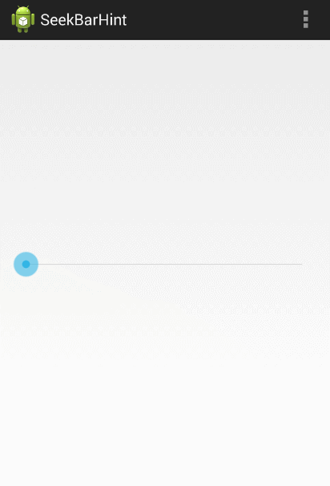

SeekBarHint
===========
[](https://android-arsenal.com/details/1/884)
### Description
SeekBarHint allows to add a SeekBar widget witch is moved and updated according to the SeekBar position.




### Integration
**1)** Add the ``it.moondroid.seekbarhint.library.SeekBarHint`` to your layout XML file.

```xml
<RelativeLayout xmlns:android="http://schemas.android.com/apk/res/android"
    xmlns:tools="http://schemas.android.com/tools"
    xmlns:hint="http://schemas.android.com/apk/res-auto"
    android:layout_width="match_parent"
    android:layout_height="match_parent"
    android:paddingLeft="@dimen/activity_horizontal_margin"
    android:paddingRight="@dimen/activity_horizontal_margin"
    android:paddingTop="@dimen/activity_vertical_margin"
    android:paddingBottom="@dimen/activity_vertical_margin"
    tools:context=".MyActivity">

    <it.moondroid.seekbarhint.library.SeekBarHint
        android:id="@+id/seekbar"
        android:layout_width="match_parent"
        android:layout_height="wrap_content"
        android:layout_centerInParent="true"
        android:max="1000"
        hint:popupOffset="8dp"
        hint:popupStyle="fixed"/>

</RelativeLayout>
```

__Available attributes__
+ ``android:rotation``: can be ``0`` or ``90`` for vertical view
+ ``popupLayout``: layout to be used, must include ``android:id/text1 TextView``
+ ``popupStyle``: can be ``fixed`` or ``follow``
+ ``popupAnimationStyle``: in/out animation or fade if unspecified
+ ``popupWidth``: the width of the popup or WRAP_CONTENT if unspecified
+ ``popupOffset``: distance from top/right of the seekbar widget
+ ``popupAlwaysShown``: do not dismiss popup after _onStopTrackingTouch_

**2)** Add theme attribute
```xml
<style name="AppTheme" parent="Theme.AppCompat.Light.DarkActionBar">
    <item name="seekBarHintStyle">@style/Widget.SeekBarHint</item>
</style>
```

**3)** Optionally customize the displayed text in Java code:

```java
SeekBarHint seekBar = (SeekBarHint) findViewById(R.id.seekbar);
seekBar.setHintAdapter(new SeekBarHint.SeekBarHintAdapter() {
    @Override
    public String getHint(SeekBarHint seekBarHint, int progress) {
        return "Progress: " + progress;
    }
});
```


### License

```
The MIT License (MIT)

Copyright (c) 2014 Marco Granatiero

Permission is hereby granted, free of charge, to any person obtaining a copy
of this software and associated documentation files (the "Software"), to deal
in the Software without restriction, including without limitation the rights
to use, copy, modify, merge, publish, distribute, sublicense, and/or sell
copies of the Software, and to permit persons to whom the Software is
furnished to do so, subject to the following conditions:

The above copyright notice and this permission notice shall be included in all
copies or substantial portions of the Software.

THE SOFTWARE IS PROVIDED "AS IS", WITHOUT WARRANTY OF ANY KIND, EXPRESS OR
IMPLIED, INCLUDING BUT NOT LIMITED TO THE WARRANTIES OF MERCHANTABILITY,
FITNESS FOR A PARTICULAR PURPOSE AND NONINFRINGEMENT. IN NO EVENT SHALL THE
AUTHORS OR COPYRIGHT HOLDERS BE LIABLE FOR ANY CLAIM, DAMAGES OR OTHER
LIABILITY, WHETHER IN AN ACTION OF CONTRACT, TORT OR OTHERWISE, ARISING FROM,
OUT OF OR IN CONNECTION WITH THE SOFTWARE OR THE USE OR OTHER DEALINGS IN THE
SOFTWARE.
```
